<h2>Mapping Object Relationnel JPA/Spring Data</h2>

<h3>Entités JPA :</h3>
<h4>Patient</h4>
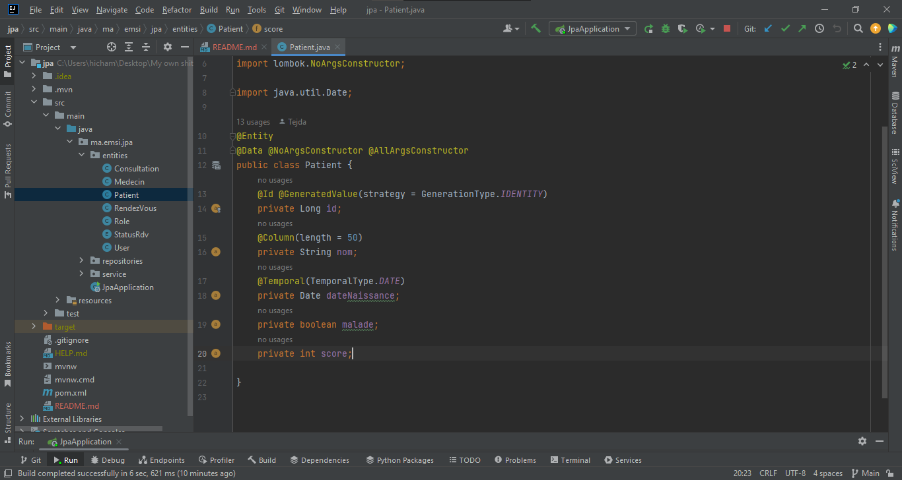
<h4>Medecin</h4>
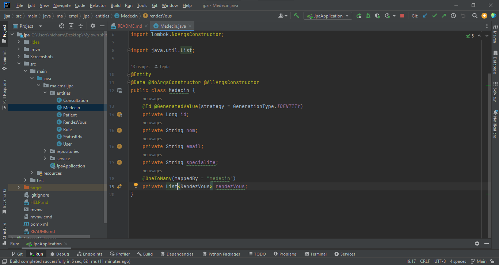
<h4>Consultation</h4>
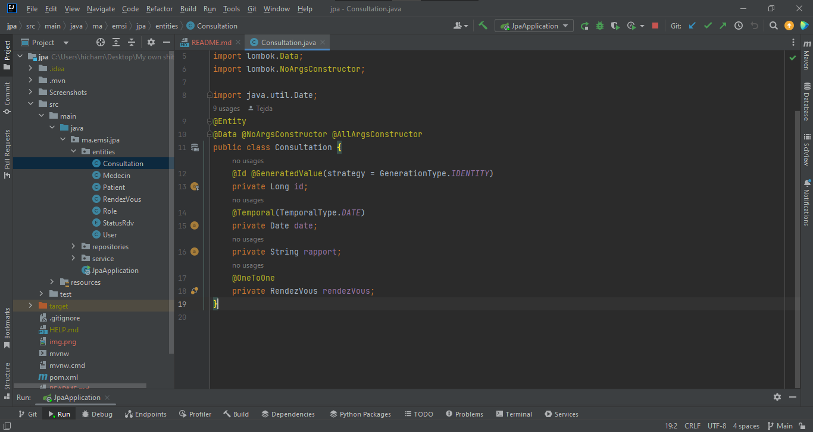
<h4>Rendez Vous</h4>
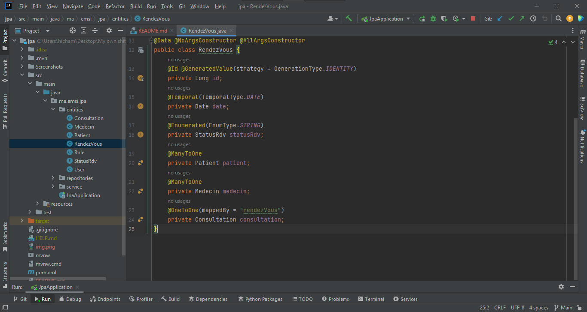
<h4>Status Rendez Vous</h4>
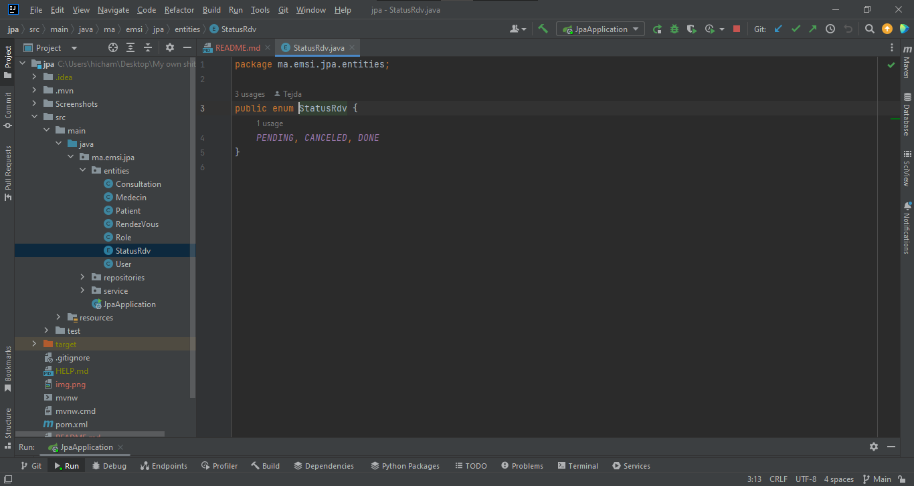
<h4>User</h4>
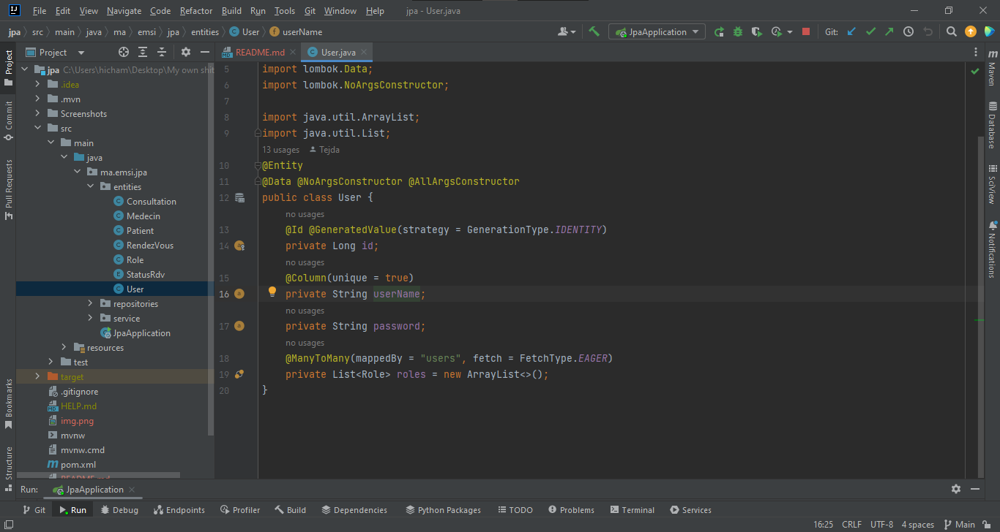
<h4>Role</h4>
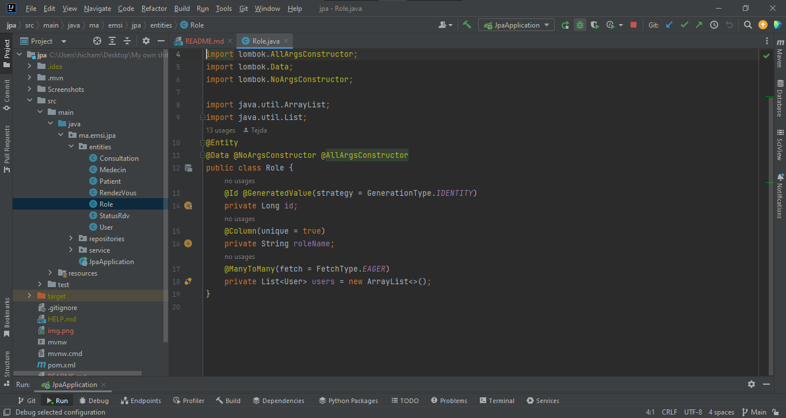

<h3>Repositories :</h3>
<h4>Les repositories implementés</h4>
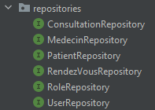
<h4>Exemple : PatientRepository</h4>
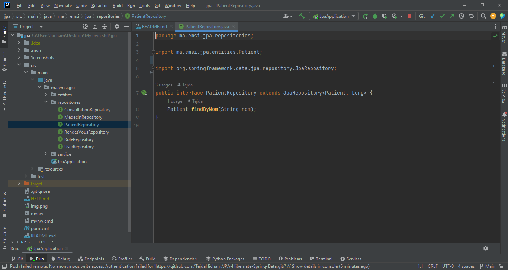

<h3>Couche Service :</h3>
<h4>IService</h4>
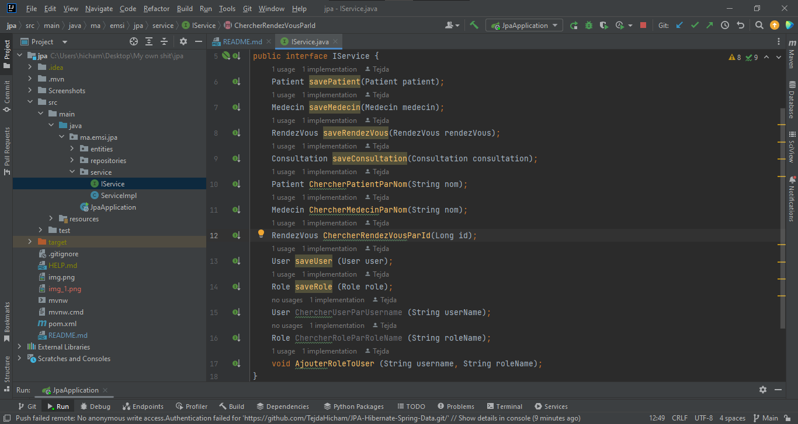
<h4>Implementaion de IService</h4>
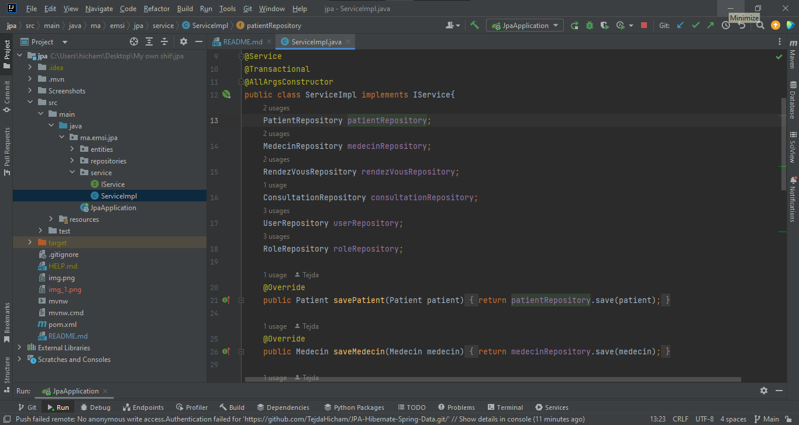
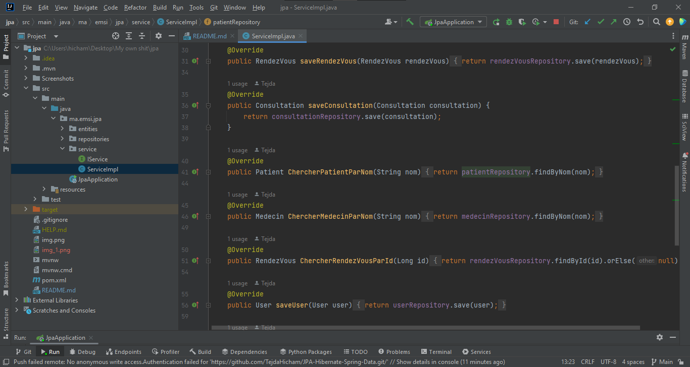
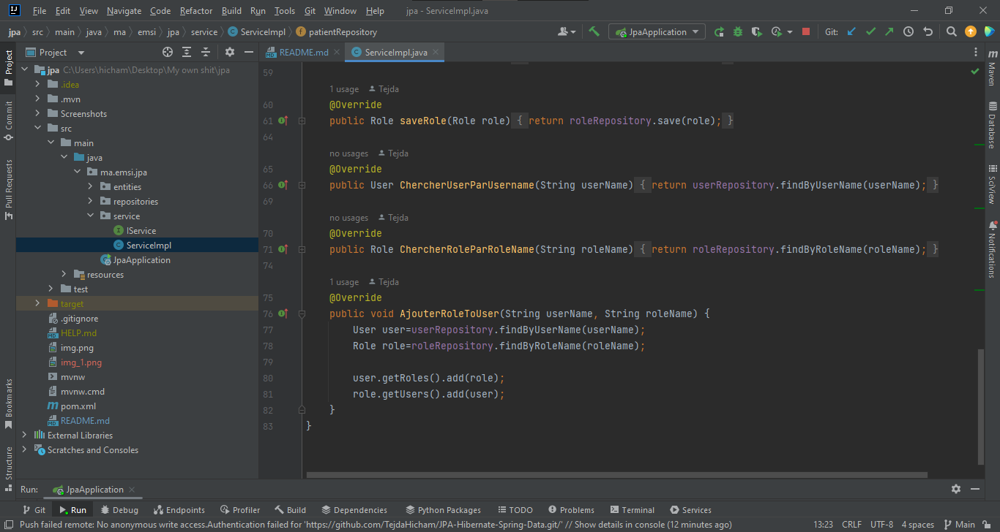

<h3>Mise en oeuvre de l'application<h3>
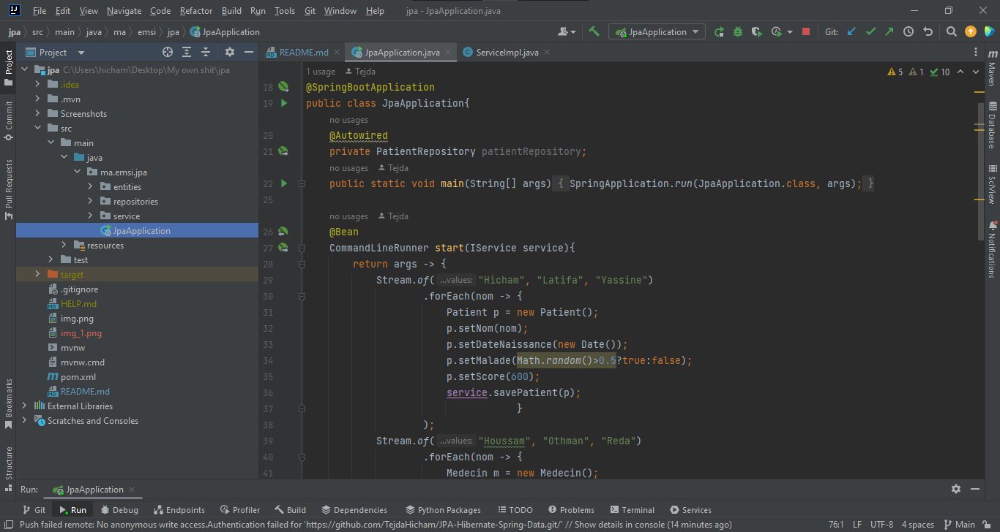
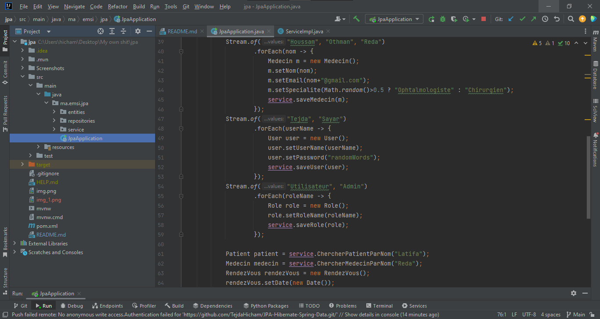
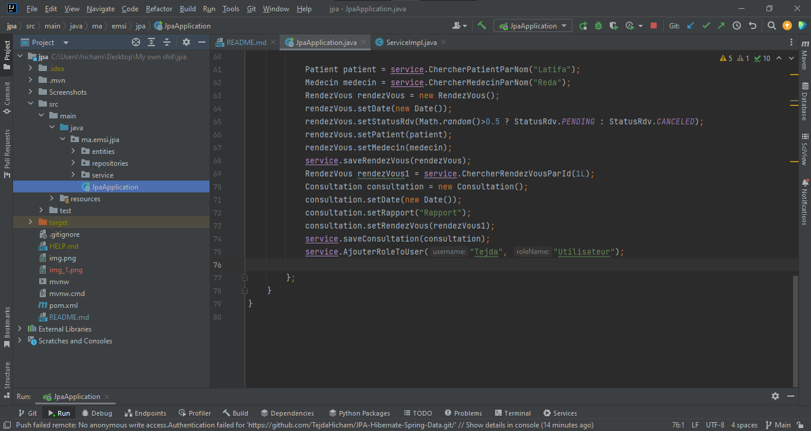

<h3>Resultat<h3>
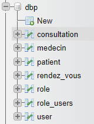